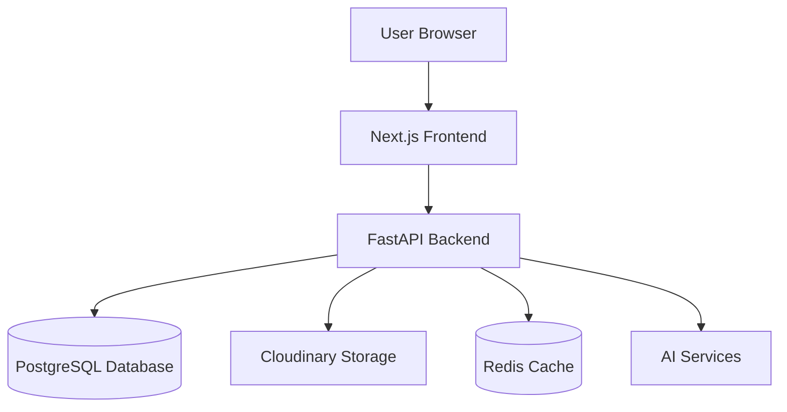
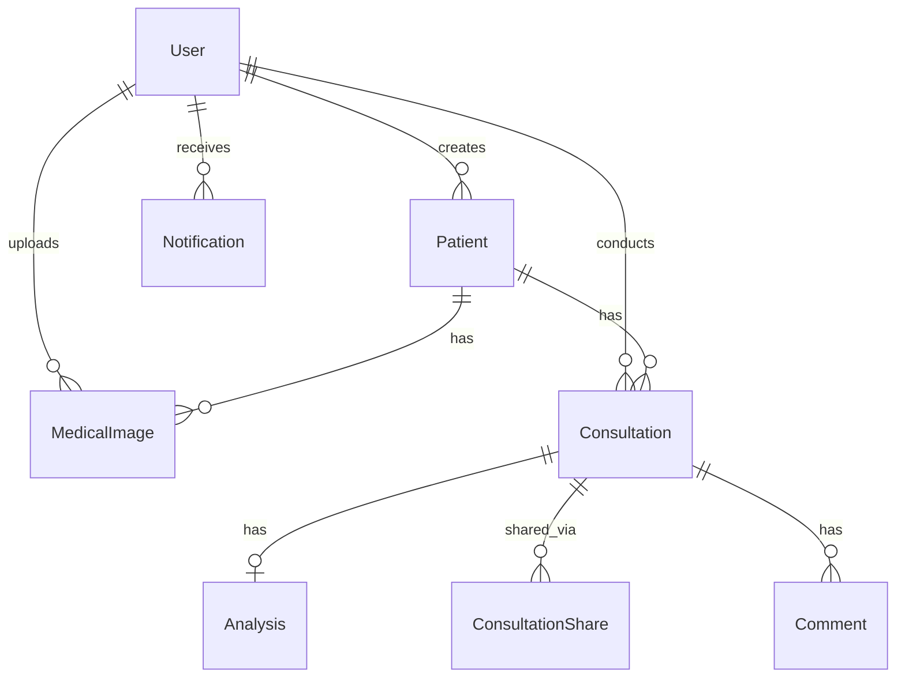
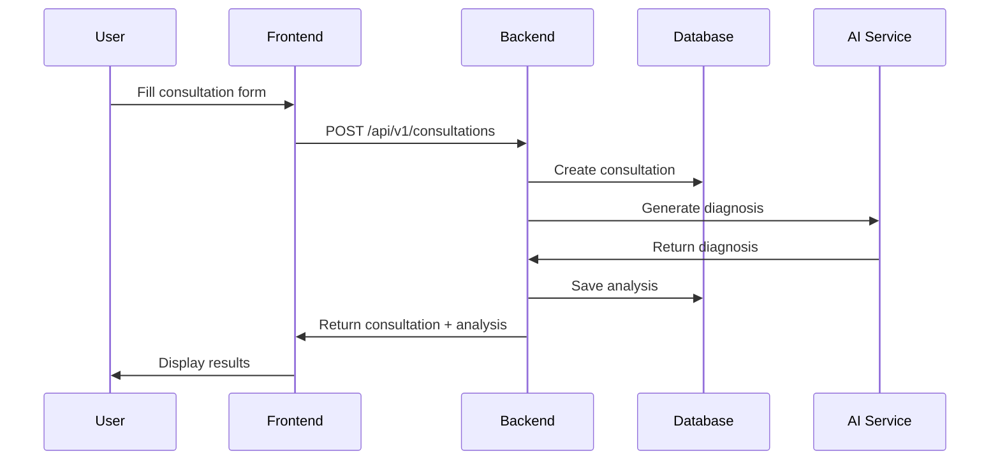
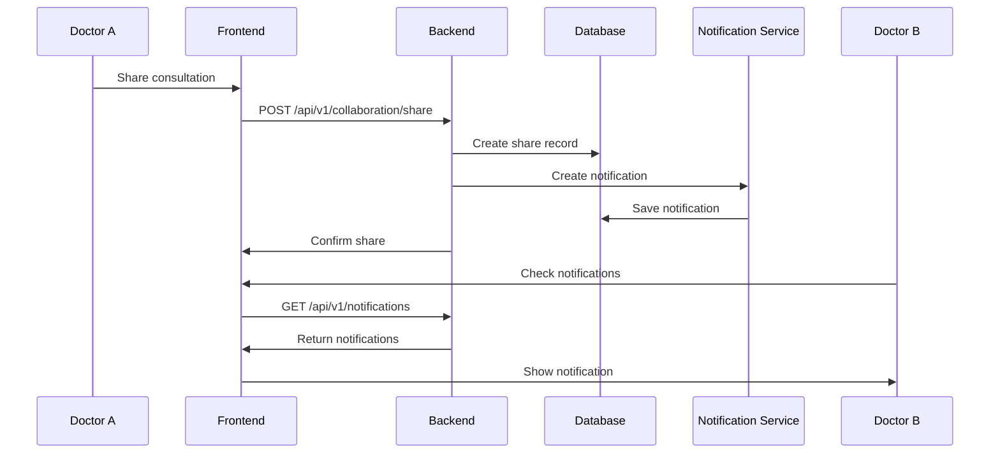

# 🏗️ Meda Architecture

This document provides a comprehensive overview of Meda's system architecture, technology stack, and design decisions.

## 📊 High-Level Architecture



## 🎯 System Overview

Meda is built as a modern, scalable medical diagnostics platform using a **microservices-inspired architecture** with clear separation between frontend, backend, and data layers.

### Core Principles

1. **Security First**: JWT authentication, 2FA, encrypted sensitive data
2. **Scalability**: Stateless API design, cloud storage, caching layer
3. **Modularity**: Clear separation of concerns, reusable components
4. **Performance**: Optimized queries, lazy loading, image optimization
5. **Maintainability**: Clean code, comprehensive documentation, type safety

## 🛠️ Technology Stack

### Frontend

| Technology | Version | Purpose |
|------------|---------|---------|
| **Next.js** | 14 | React framework with App Router |
| **React** | 18 | UI component library |
| **TypeScript** | 5 | Type-safe JavaScript |
| **Tailwind CSS** | 3.4 | Utility-first CSS framework |
| **Framer Motion** | - | Animation library |
| **Konva** | - | Canvas manipulation for image viewer |
| **Shadcn/UI** | - | Accessible component library |

### Backend

| Technology | Version | Purpose |
|------------|---------|---------|
| **FastAPI** | 0.109.0 | Modern Python web framework |
| **Python** | 3.11+ | Programming language |
| **SQLAlchemy** | 2.0.25 | ORM for database operations |
| **PostgreSQL** | 15+ | Relational database |
| **Alembic** | - | Database migrations |
| **Argon2** | - | Password hashing |
| **JWT** | - | Token-based authentication |
| **Cloudinary** | - | Cloud image storage |
| **ReportLab** | 4.4.6 | PDF generation |

### Infrastructure

| Technology | Purpose |
|------------|---------|
| **Docker** | Containerization |
| **Docker Compose** | Multi-container orchestration |
| **Redis** | Caching and session management |
| **Render.com** | Cloud deployment platform |

## 🗄️ Database Schema

### Core Models

#### User
```python
- id: Integer (PK)
- email: String (unique)
- full_name: String
- hashed_password: String
- is_active: Boolean
- is_verified: Boolean
- totp_secret: String (encrypted)
- created_at: DateTime
- updated_at: DateTime
```

#### Patient
```python
- id: Integer (PK)
- user_id: Integer (FK -> User)
- name: String
- date_of_birth: Date
- gender: String
- phone: String
- email: String
- address: Text
- medical_history: Text
- allergies: Text
- created_at: DateTime
- updated_at: DateTime
```

#### MedicalImage
```python
- id: Integer (PK)
- user_id: Integer (FK -> User)
- patient_id: Integer (FK -> Patient)
- filename: String
- cloudinary_public_id: String
- cloudinary_url: String
- file_type: String
- file_size: Integer
- description: Text
- created_at: DateTime
```

#### Consultation
```python
- id: Integer (PK)
- patient_id: Integer (FK -> Patient)
- doctor_id: Integer (FK -> User)
- consultation_date: DateTime
- chief_complaint: Text
- symptoms: JSON
- vital_signs: JSON
- diagnosis: Text
- treatment_plan: Text
- notes: Text
- created_at: DateTime
- updated_at: DateTime
```

#### Analysis
```python
- id: Integer (PK)
- consultation_id: Integer (FK -> Consultation)
- diagnosis: Text
- differential_diagnoses: JSON
- recommended_tests: JSON
- priority: String
- confidence_score: Float
- created_at: DateTime
```

#### Notification
```python
- id: Integer (PK)
- user_id: Integer (FK -> User)
- type: String
- title: String
- message: Text
- link: String
- is_read: Boolean
- created_at: DateTime
```

### Relationships



## 🔐 Security Architecture

### Authentication Flow

1. **Registration**
   - User submits email and password
   - Password hashed with Argon2
   - TOTP secret generated for 2FA
   - User record created in database

2. **Login**
   - User submits credentials
   - Password verified against hash
   - 2FA code validated
   - JWT access token issued (15 min expiry)
   - JWT refresh token issued (7 day expiry)

3. **Token Refresh**
   - Client sends refresh token
   - New access token issued
   - Refresh token rotated

### Authorization

- **Role-Based Access Control (RBAC)**: Users have roles (doctor, admin)
- **Resource Ownership**: Users can only access their own resources
- **Sharing Permissions**: Consultations can be shared with READ or WRITE permissions

### Data Protection

- **Password Hashing**: Argon2 (memory-hard, resistant to GPU attacks)
- **2FA Secrets**: Encrypted at rest
- **HTTPS**: All communications encrypted in transit
- **CORS**: Configured to allow only trusted origins

## 🎨 Frontend Architecture

### Directory Structure

```
frontend/
├── app/                    # Next.js App Router pages
│   ├── (auth)/            # Authentication pages
│   ├── dashboard/         # Dashboard page
│   ├── patients/          # Patient management
│   ├── images/            # Image gallery
│   └── consultations/     # Consultation pages
├── components/            # Reusable React components
│   ├── image-viewer/      # Medical image viewer
│   ├── notifications/     # Notification system
│   └── ui/               # UI components (Shadcn)
└── lib/                  # Utilities and API clients
    ├── api.ts            # Main API client
    ├── api-notifications.ts
    └── utils.ts
```

### State Management

- **React Hooks**: `useState`, `useEffect` for local state
- **Context API**: Theme management (dark/light mode)
- **Server Components**: Data fetching in Next.js server components
- **Client Components**: Interactive UI with 'use client' directive

### Routing

- **App Router**: Next.js 14 file-based routing
- **Dynamic Routes**: `[id]` for patient and consultation details
- **Protected Routes**: Authentication checks in middleware
- **API Routes**: `/api` endpoints for server-side logic

## 🔧 Backend Architecture

### Directory Structure

```
backend/
├── app/
│   ├── api/              # API endpoints
│   │   └── v1/          # API version 1
│   │       ├── auth.py
│   │       ├── patients.py
│   │       └── endpoints/
│   ├── core/            # Core configuration
│   │   ├── config.py
│   │   ├── database.py
│   │   └── security.py
│   ├── models/          # SQLAlchemy models
│   ├── services/        # Business logic
│   └── main.py         # FastAPI application
└── requirements.txt
```

### API Design

- **RESTful**: Standard HTTP methods (GET, POST, PUT, PATCH, DELETE)
- **Versioned**: `/api/v1/` prefix for version control
- **Documented**: Auto-generated OpenAPI docs at `/docs`
- **Validated**: Pydantic models for request/response validation
- **Error Handling**: Consistent error responses with status codes

### Service Layer

Business logic is separated into service modules:

- **`notification_service.py`**: Notification creation and management
- **`diagnosis_service.py`**: AI diagnosis generation
- **`report_service.py`**: PDF report generation
- **`collaboration_service.py`**: Sharing and comments

## 🚀 Deployment Architecture

### Development

```
Developer Machine
├── Frontend (localhost:3000)
├── Backend (localhost:8000)
└── PostgreSQL (localhost:5432)
```

### Production (Render.com)

```
Render.com
├── Frontend Service (Next.js)
├── Backend Service (FastAPI)
├── PostgreSQL Database
└── Redis Cache
```

### Docker Deployment

```yaml
Services:
  - frontend: Next.js app
  - backend: FastAPI app
  - postgres: Database
  - redis: Cache
  - minio: Object storage (dev only)
```

## 📈 Performance Optimizations

### Frontend

- **Code Splitting**: Automatic with Next.js
- **Image Optimization**: Next.js Image component
- **Lazy Loading**: Components loaded on demand
- **Caching**: Browser caching for static assets
- **Debouncing**: Search inputs debounced

### Backend

- **Database Indexing**: Indexes on frequently queried columns
- **Query Optimization**: Eager loading with `joinedload`
- **Connection Pooling**: SQLAlchemy connection pool
- **Caching**: Redis for session data
- **Async Operations**: FastAPI async endpoints

## 🔄 Data Flow Examples

### Creating a Consultation with AI Diagnosis



### Sharing a Consultation



## 🧪 Testing Strategy

### Backend Testing
- **Unit Tests**: Test individual functions and services
- **Integration Tests**: Test API endpoints
- **Database Tests**: Test models and queries

### Frontend Testing
- **Component Tests**: Test React components
- **E2E Tests**: Test user flows
- **Visual Tests**: Test UI consistency

## 📚 Additional Resources

- [API Reference](API_REFERENCE.md) - Complete API documentation
- [Database Migrations](../backend/README.md#migrations) - How to manage schema changes
- [Deployment Guide](GETTING_STARTED.md#deployment) - Production deployment steps

---

**Last Updated**: December 19, 2024  
**Architecture Version**: 2.0
